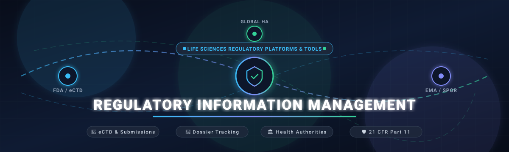

  

  
  
  
  
  

# 🏛️ Awesome Regulatory Information Management (RIM)

> 🔬 **A comprehensive, SEO-optimized, and curated directory of enterprise SaaS platforms, eCTD publishing software, and open-source tools for Regulatory Information Management (RIM) in Life Sciences, Pharmaceuticals, Biotechnology, and Medical Devices.**

*Covering global submission planning, eCTD dossier assembly, health authority correspondence (FDA, EMA, PMDA, NMPA), labeling management, IDMP / SPOR data standards, and GxP / 21 CFR Part 11 compliance.*

**📅 Last updated: September 2026**

---

## 📑 Table of Contents

- [🔍 Overview](#-overview)
- [📊 Market Overview & Dynamics](#-market-overview--dynamics)
- [☁️ SaaS & Hosted Platforms](#️-saas--hosted-platforms)
- [💻 Open-Source GitHub Projects](#-open-source-github-projects)
- [🛠️ Additional Open-Source Capabilities](#️-additional-open-source-capabilities)
- [🤝 How to Contribute](#-how-to-contribute)
- [📈 Star History](#-star-history)
- [⚖️ Disclaimer](#️-disclaimer)

---

## 🔍 Overview

**Regulatory Information Management (RIM)** systems serve as the central source of truth for life-sciences organizations navigating complex global regulatory pathways. These platforms manage the end-to-end regulatory lifecycle:

- 📋 **Submission Planning & Tracking**: Managing electronic Common Technical Document (eCTD 3.2.2 / v4.0), NeeS, and non-eCTD submission milestones.
- 🏛️ **Health Authority Interactions**: Logging requests for information (RFIs), commitments, inspections, and correspondence with the FDA, EMA, PMDA, and other agencies.
- 💊 **Product Registrations & Variations**: Real-time tracking of marketing authorizations, variations, line extensions, and country-level license renewals across 150+ jurisdictions.
- 🏷️ **Labeling & Artwork**: Version-controlled structured product labeling (SPL), core data sheets (CCDS), and local product inserts.
- 🛡️ **Regulatory Compliance & GxP**: Meeting strict FDA 21 CFR Part 11, EU Annex 11, and ISO 13485 audit trail and electronic signature requirements.

---

## 📊 Market Overview & Dynamics

> 📈 **Sector Size & Growth**: The global Regulatory Information Management (RIM) market is estimated at **$2.5 to $2.8 Billion** (projected to reach **$5.5+ Billion by 2033–2035** at a **9.5%–11% CAGR**).
> 
> 🎯 **Market Structure**: The sector is **moderately to highly concentrated** at the top-tier biopharma enterprise level (dominated by pure-play SaaS market leader Veeva Systems alongside conglomerates like Honeywell Sparta and ArisGlobal), while exhibiting **moderate fragmentation** across mid-market life sciences, MedTech specialists (e.g., Rimsys, Kivo), and regional eCTD publishing solutions.

---

## ☁️ SaaS & Hosted Platforms

Below is the verified breakdown of leading commercial RIM suites, ranked in descending order by parent company / corporate scale:

| 🏢 Platform | 💰 Company Scale (Revenue / Valuation) | 🎯 Key Capabilities & Focus | 🏷️ Starting Pricing | ⏱️ Free Tier / Free Trial Limits |
| :--- | :--- | :--- | :--- | :--- |
| **[Sparta TrackWise Digital](https://www.spartasystems.com/trackwise-digital/)** | ~$38.5B Rev / ~$135B Mkt Cap (Honeywell parent; Sparta acquired for $1.3B) | Enterprise quality and regulatory tracking platform handling change control, regulatory impact analysis, and compliance workflows. | $500/month ($6,000/year) per module under QuickTrack; full enterprise RIM/QMS packages starting ~$30,000/year | 14-day guided proof-of-concept sandbox (limited to 5 users, 2 configured regulatory workflows, and mock audit trails) |
| **[DXC RIM / FirstDoc](https://dxc.com/us/en/industries/life-sciences)** | ~$13.7B Annual Rev / ~$4.5B Mkt Cap (NYSE: DXC) | Enterprise document management and eCTD submission automation software designed for biopharma compliance. | $2,584.40 per user license (+ $516.88 initial support fee) under GSA Schedule (Contract 47QTCA26D001Q); ~$35,000/year base tier | 30-day proof-of-concept pilot environment (limited to 5 named users, 1 sample dossier hierarchy, and test document routing) |
| **[Phlexglobal PhlexRIM](https://www.phlexglobal.com/)** | ~$11.2B Annual Rev / ~$28B Mkt Cap (Wipro parent company) | Integrated regulatory operations and dossier management suite combining automated publishing with regulatory intelligence. | $1,500/month (~$18,000/year) for starter sponsor submission package | 14-day vendor-assisted evaluation sandbox (limited to 3 user accounts, 1 pilot submission project, and mock regulatory exchange) |
| **[Veeva Vault RIM](https://www.veeva.com/products/vault-rim/)** | ~$2.75B Annual Rev / ~$43B Mkt Cap (NYSE: VEEV) | Enterprise cloud-native RIM suite for end-to-end biopharma submissions, registrations, and labeling. | $500 – $2,400 per user/year (base module environments start at ~$25,000/year; typical starter contract ~$50,000/year) | 14-day guided proof-of-concept (POC) sandbox (limited to 5 user logins, test eCTD dossiers, and non-production gateway testing; SiteVault tier is free forever for up to 20 active clinical studies) |
| **[MasterControl Regulatory](https://www.mastercontrol.com/regulatory/)** | ~$180M ARR / $1.3B Valuation (Sixth Street backed) | Regulatory excellence and document control platform supporting change management, dossier compilation, and compliance workflows. | $1,095/month (~$13,140 to $25,000/year base deployment for named users) | 14-day vendor-provisioned trial environment (limited to 5 named users, 100 managed documents, and pre-configured GxP workflow templates) |
| **[ArisGlobal LifeSphere RIM](https://www.arisglobal.com/lifesphere-regulatory/)** | ~$200M ARR / $1.2B Valuation (Nordic Capital backed) | Comprehensive regulatory platform covering RIM, dossier management, publishing, and safety integration (including former Amplexor suite). | $2,200 per user/year (or ~$35,000/year base deployment package) | 14-day guided evaluation sandbox (limited to 3 administrative users, up to 2 test submission dossiers, and mock health-authority tracking) |
| **[Freyr SUBMIT PRO](https://www.freyrdigital.com/submit-pro)** | ~$75M Annual Rev / ~$450M Valuation | Cloud-native eCTD software enabling dossier authoring, validation, life cycle management, and submission publishing across global HAs. | $4,125 per user/year for SUBMIT PRO GEO (or $1,925 for 3-month lease; $1,450 per additional Health Authority) | 48-hour live interactive trial sandbox (limited to 1 user seat, 2 selected Health Authorities, and 1 test eCTD submission sequence) |
| **[LORENZ docuBridge](https://www.lorenz.cc/eSolutions/docuBridge-one/)** | ~$45M Annual Revenue (Global category specialist) | Specialist eCTD submission management and publishing software used for compiling and lifecycle-managing dossiers for global health authorities. | $2,950 net base license for docuBridge ONE (includes 1 single-user workstation license, 1 submission sequence token, 1 training token, and 1 support token; additional sequences at ~$1,200/token) | 30-day evaluation license (limited to 1 local workstation installation, 1 pre-set test region eCTD sequence, and watermarked sequence export) |
| **[Ennov Regulatory Suite](https://www.ennov.com/regulatory/)** | ~$38M Annual Revenue (European life-sciences leader) | Modular European-origin regulatory affairs platform with robust support for EMA variations, eCTD authoring, and submission tracking. | €5,000/year (~$5,450 USD/year) for base module; ~$150 – $220 per user/month for standard seats | 30-day guided pilot sandbox (limited to 3 test users, 1 active product dossier, and test EMA/FDA submission package generation) |
| **[EXTEDO eRA / EXTEDOpulse](https://www.extedo.com/)** | ~$30M Annual Revenue (Specialized eRA/eCTD provider) | Life sciences regulatory affairs suite providing eCTD publishing (eCTDmanager), registration management, and EURS validation. | €4,500/year (~$4,900 USD/year) for base submission/validation modules; eCTDmanager cloud seats from ~$250/user/month | 14-day cloud evaluation sandbox (limited to 2 users, sample regional DTD validation, and test dossier compilation without live gateway transmission) |
| **[Generis CARA](https://www.generiscorp.com/)** | ~$25M Annual Revenue | Unified data and content management platform for regulatory submissions, labeling, quality, and clinical processes. | £65 (~$82 USD) per user/month for Core Plan (£90/user/month for Professional, £115/user/month for Enterprise) | 14-day guided proof-of-concept environment (limited to 5 user logins, 500 test documents/metadata objects, and pre-built life-sciences workflows) |
| **[Rimsys RIM](https://www.rimsys.io/)** | ~$12M ARR / ~$70M Valuation (MedTech RIM leader) | Cloud-based RIM platform engineered specifically for medical devices, IVDs, and global market authorization tracking. | $1,250/month ($15,000/year billed annually) for Core tier (covers up to 50 active product SKUs with unlimited users) | 14-day interactive trial sandbox (limited to 1 product line and up to 10 device SKUs; includes free forever access to Rimsys Intel public regulatory database) |
| **[AmpleLogic RIMS](https://www.amplelogic.com/regulatory-information-management-system-rims/)** | ~$10M Annual Revenue (Pharma low-code specialist) | Low-code web-based RIMS for tracking product registrations, variations, ANDA/DMF filings, and health authority commitments across 120+ countries. | $800/month ($9,600/year) for base tier supporting up to 10 users | 14-day guided sandbox access (limited to 3 test user profiles, 5 sample product registrations, and standard compliance dashboards) |
| **[Kivo GO RIM](https://kivo.io/)** | ~$7M ARR / ~$35M Valuation (Emerging biotech RIM) | Unified, intuitive RIM and submission management platform built for emerging pharma and biotech teams with integrated eTMF and QMS. | $950/month ($11,400/year billed annually) for team tier (covers 5 users with full RIM & DMS modules included) | 14-day free trial (limited to 3 team members, 25 documents, and 1 test eCTD dossier structure) |

---

## 💻 Open-Source GitHub Projects

Open-source regulatory initiatives provide transparent standards, evaluation packages, NMRA workflows, and submission validators. Ranked in descending order by GitHub stars:

- **[FDA / openfda](https://github.com/FDA/openfda)**   
  🏛️ Official U.S. Food and Drug Administration open-source data APIs, ingestion pipelines, and schema definitions for querying drug, medical device, and food regulatory approvals, adverse event reports, recall notices, and structured product labeling.

- **[pharmaverse / admiral](https://github.com/pharmaverse/admiral)**   
  📊 Open-source modular toolbox for Clinical Data Interchange Standards Consortium (CDISC) Analysis Data Model (ADaM) datasets required for FDA, EMA, and PMDA eCTD regulatory submissions and dossier review packages.

- **[insightsengineering / teal](https://github.com/insightsengineering/teal)**   
  📈 Modular, interactive Shiny-based dashboard framework created by biopharma leaders for visual exploration, safety analysis, and clinical trial data monitoring during regulatory submissions and dossier evaluations.

- **[openregulatory / templates](https://github.com/openregulatory/templates)**   
  📝 Open templates and resources for ISO 13485, IEC 62304, ISO 14971, IEC 62366, EU MDR/IVDR, and FDA 510(k) medical-device and Software as a Medical Device (SaMD) compliance documentation.

- **[pharmaR / riskmetric](https://github.com/pharmaR/riskmetric)**   
  🧪 R package risk assessment framework developed by the R Validation Hub to evaluate R package quality, reproducibility, and suitability for use in validated GxP environments and biopharma regulatory submissions.

- **[phuse-org / phuse-scripts](https://github.com/phuse-org/phuse-scripts)**   
  📚 Collaborative Pharmaceutical Users Software Exchange (PHUSE) code repository providing standard regulatory analyses, clinical summary tables, and figures accepted across global health authorities.

- **[MeyerThorsten / QAtrial](https://github.com/MeyerThorsten/QAtrial)**   
  🤖 Open-source AI-powered quality and regulatory compliance management platform for regulated life sciences, featuring eTMF, CAPA, design controls, deviations, and 21 CFR Part 11 audit trails.

- **[cdisc-org / conformance-rules-editor](https://github.com/cdisc-org/conformance-rules-editor)**   
  📐 CDISC open-source tool for authoring, editing, and managing machine-readable regulatory data conformance rules for Study Data Tabulation Model (SDTM) submission packages.

- **[regulatorystudies / regulatory_data_repository](https://github.com/regulatorystudies/regulatory_data_repository)**   
  🌐 Tools and code for obtaining, cleaning, and analyzing publicly available regulatory data, rulemaking dockets, and federal Unified Agenda submissions.

- **[MSH / OpenRIMS](https://github.com/MSH/OpenRIMS)**   
  🏥 Free and open-source Regulatory Information Management System designed by Management Sciences for Health to assist National Medicines Regulatory Authorities (NMRAs). Supports country-specific business processes, dossier evaluation tracking, and registration certificates without re-programming.

- **[zavora-ai / mcp-regulatory](https://github.com/zavora-ai/mcp-regulatory)**   
  ⚡ Regulatory Model Context Protocol (MCP) server for automated compliance screening, submission filings, regulatory change tracking, and change control verification.

---

## 🛠️ Additional Open-Source Capabilities

- 🔍 **eCTD Validation & Viewing**: Community utilities for verifying DTD/XSD conformance against FDA, EMA, and Health Canada specifications.
- 📦 **Labeling & Structured Content**: XML and SPL parsing libraries for drug package insert lifecycle maintenance.
- 🔄 **Regulatory Workflow Engines**: Configurable open BPM engines mapped to variations, renewals, and country clearances.
- 🔐 **Audit Trails & Integrity Patterns**: Immutable event stores complying with 21 CFR Part 11 requirements.
- 🌐 **FAIR Data & RDM Toolkits**: Open frameworks facilitating reproducible, audit-ready data exchange.

---

## 🤝 How to Contribute

Contributions are welcome and appreciated! To propose additions or updates:

1. 🍴 Fork this repository.
2. 🌿 Create a feature branch (`git checkout -b feature/new-rim-platform`).
3. ✏️ Update `README.md` following the established tabular or badge formats.
4. 🚀 Push changes and open a Pull Request with verifiable reference links.

⭐ **If you find this directory valuable, star the repo to support open life-sciences resources!**

---

## 📈 Star History

---

## ⚖️ Disclaimer

- 📌 *This repository is a community-curated educational index and does not constitute regulatory, legal, or validated software endorsement.*
- 🛡️ *Regulatory Information Management software operates in heavily regulated GxP environments directly affecting patient safety and public health. All production software must undergo formal computerized system validation (CSV / CSA) under applicable predicate rules (US FDA 21 CFR Part 11, EU Annex 11, GAMP 5, ISO 13485).*
- 💡 *Open-source tools assist research, academic institutions, and national authorities, but sponsors remain solely responsible for agency dossier acceptance and validation compliance.*

---

  <b>Curated with ❤️ for Regulatory Affairs (RA) Leaders, Submission Specialists, eCTD Publishers, and Life Sciences Technologists Worldwide.</b> 
  Explore more curated lists on <a href="https://github.com/ishandutta2007/Awesome-Awesome-Awesome">Awesome-Awesome-Awesome</a>.

